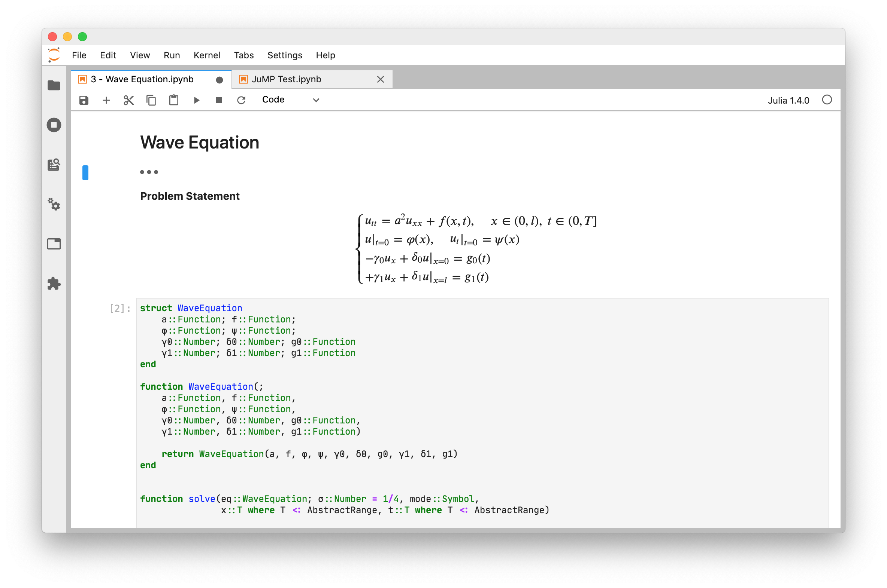

# JupyterLab App for macOS
An app that launches and displays jupyter-lab.



### Overview

Unfortunately, [the official desktop app](https://github.com/jupyterlab/jupyterlab_app) succesfully died,
so this is one of many apps that try to replace it.

This app can run jupyter-lab:

- in a separate window like it's own app (because it is) and not in browser tab
- without an opened terminal window (but if you like it, just use it as an *c.LabApp.browser*)

It is written on Swift and SwiftUI. It is my first project on Swift, sorry about bad coding style.

### Why another similar app?
I thought it will be a good practise for me. Almost every app that I found didn't do what I wanted.
The best one that I found is [this one](https://github.com/nanoant/jupterlab-macos-runner), but it's written on another language.
I was trying to fix webview problem (see known bugs), but I had no luck.
This app still uses different mechanics to run and stop jupyter-lab.

### Where to download?
[Right here!](https://github.com/s-valent/jupyterlab-app/releases)

### How to run?
Make sure you've already installed python and jupyter-lab and everything works fine.

Make sure you placed jupyter at `/usr/local/bin/jupyter` (jupyter-lab is not required).
If you haven't already, it's just `ln -s /path/to/your/jupyter /usr/local/bin/jupyter` in terminal.

You will probably want to write this to you *jupyter_notebook_config.py*:
```
c.LabApp.browser = '/Applications/JupyterLab.app/Contents/MacOS/JupyterLab %s
c.NotebookApp.notebook_dir = "/your/homedir/"   # don't forget to change to your home directory
```
If everything is ready, just click the app icon. You also can run it from terminal as `jupyter lab`.


### Disclaimers
- icon borrowed [here](https://github.com/nanoant/jupterlab-macos-runner) (simular project)
which is taken from [here](https://jupyter.org) and slightly redesigned.

### Knows Bugs
- if app stays inactive for a while (~3-4 min for me), webview doesn't respond immediately.
(Please, help me! I have absolutely no idea how to fix it).
